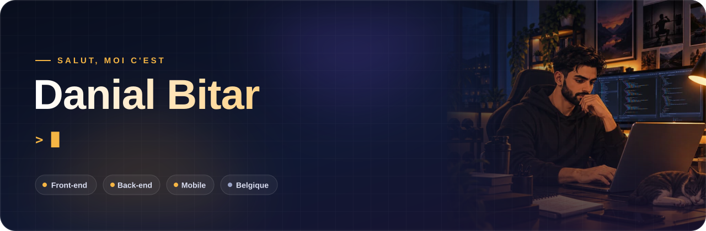
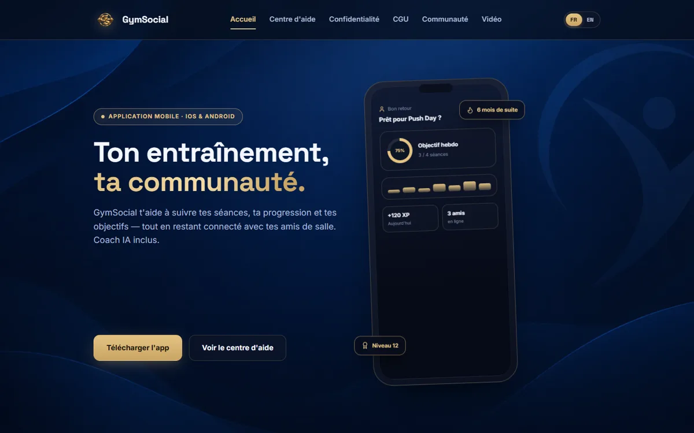
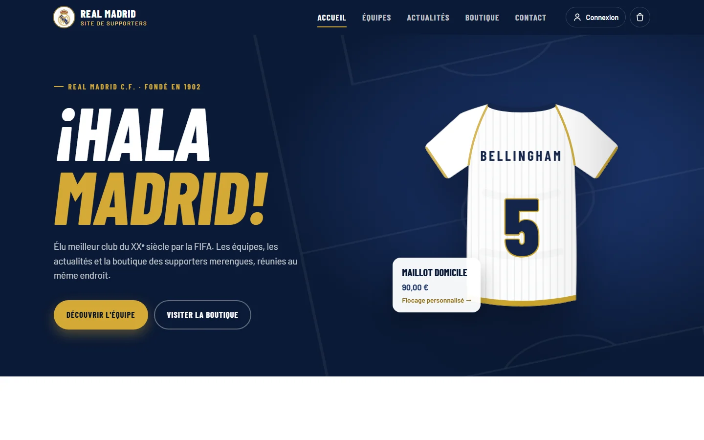
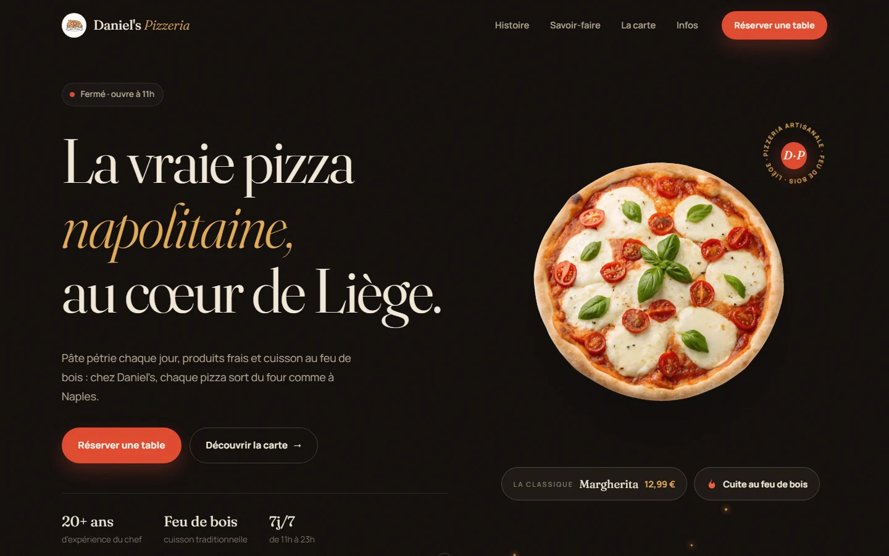
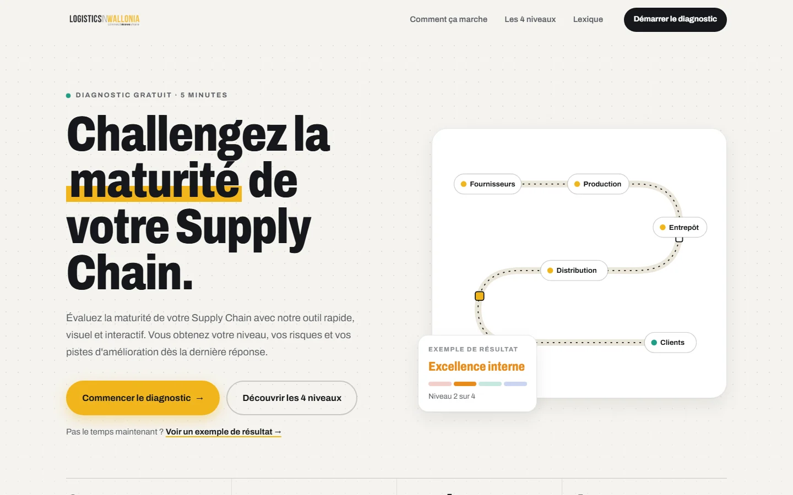

<div align="center">

<a href="https://danidois2002.github.io/portfolio/"></a>

<br />

<a href="https://danidois2002.github.io/portfolio/"></a>
<a href="https://www.linkedin.com/in/daniel-bitar-992ab3258"></a>
<a href="mailto:dbitar77@gmail.com"></a>
<a href="https://www.instagram.com/dbitar_/"></a>
<a href="https://www.gymsocial.eu"></a>

</div>

<br />

## 🧑‍💻 À propos

```js
const danial = {
  role:        "Développeur web junior",
  focus:       ["Front-end", "Back-end", "Mobile"],
  formation:   "Développement Back-End · IFAPME Liège (2026-2027)",
  pays:        "Belgique",
  langues:     ["Français", "Anglais", "Arabe", "Arménien"],
  projetPhare: "GymSocial, mon app mobile de fitness (lancement prévu en décembre 2026)",
  devise:      "Transformer des idées en code, un commit à la fois.",
};
```

## 🛠️ Ma stack

<p align="center">
  
  <br />
  
</p>

## 🚀 Projets à la une

<table>
  <tr>
    <td width="50%" valign="top">
      <a href="https://www.gymsocial.eu"></a>
      <h3><a href="https://www.gymsocial.eu">💪 GymSocial</a></h3>
      <p>Mon plus gros projet : une app mobile <b>Android et iOS</b> de fitness. Suivi de séance, coach IA, nutrition, réseau social, badges et synchronisation entre appareils.</p>
      <p>
        
        
        
        
      </p>
      <a href="https://www.gymsocial.eu"><b>gymsocial.eu →</b></a>
    </td>
    <td width="50%" valign="top">
      <a href="https://danidois2002.github.io/HalaMadrid/"></a>
      <h3><a href="https://danidois2002.github.io/HalaMadrid/">⚽ ¡Hala Madrid!</a></h3>
      <p>Site de supporters du Real Madrid, <b>full-stack</b> : un front React relié à une <b>API Node.js / PostgreSQL</b>. Connexion JWT avec rôles, commandes calculées par le serveur, 22 tests automatisés et des maillots SVG à floquer en direct.</p>
      <p>
        
        
        
        
      </p>
      <a href="https://danidois2002.github.io/HalaMadrid/"><b>Démo →</b></a> · <a href="https://github.com/Danidois2002/HalaMadrid">Code</a>
    </td>
  </tr>
  <tr>
    <td width="50%" valign="top">
      <a href="https://danidois2002.github.io/Pizzeria/"></a>
      <h3><a href="https://danidois2002.github.io/Pizzeria/">🍕 Daniel's Pizzeria</a></h3>
      <p>Site vitrine d'une pizzeria : carte interactive, statut <b>« ouvert / fermé » en direct</b> et réservation avec créneaux et résumé.</p>
      <p>
        
        
        
      </p>
      <a href="https://danidois2002.github.io/Pizzeria/"><b>Démo →</b></a> · <a href="https://github.com/Danidois2002/Pizzeria">Code</a>
    </td>
    <td width="50%" valign="top">
      <a href="https://danidois2002.github.io/LIW/"></a>
      <h3><a href="https://danidois2002.github.io/LIW/">📦 Diagnostic Supply Chain</a></h3>
      <p>Quiz de maturité réalisé pendant mon <b>stage chez Logistics in Wallonia</b> : 27 questions, résultat avec graphiques et rapport PDF.</p>
      <p>
        
        
        
      </p>
      <a href="https://danidois2002.github.io/LIW/"><b>Démo →</b></a> · <a href="https://github.com/Danidois2002/LIW">Code</a>
    </td>
  </tr>
</table>

<p align="center"><a href="https://danidois2002.github.io/portfolio/"><b>Tout voir sur mon portfolio →</b></a></p>

## 🐍 Mes contributions

<p align="center">
  <picture>
    <source media="(prefers-color-scheme: dark)" srcset="https://raw.githubusercontent.com/Danidois2002/Danidois2002/output/github-snake-dark.svg" />
    
  </picture>
</p>

<div align="center">
  
</div>
